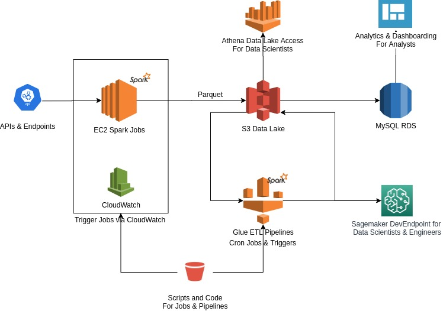
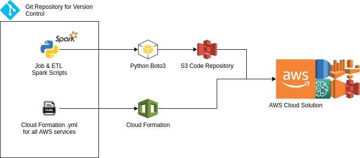

# Technical Assignment
*Dirk Steynberg*

The POC here makes use of a `main.py` file which can be run on any system with PySpark to showcase how
Jobs and Pipelines would work in a real environment. You can set up your python venv to run the POC and
install the requirements with pip `pip install -r requirements.txt` via the root folder.

Attach a `.env` file in root with the structure below:
```.env
NEWSAPI_KEY=your newsapi.org security key
DB_URL=your mysql database url
DB_USER=databse username
DB_PASSWORD=datbase password
```

The MySQL Database setup should be:
```
newsapi_articles
 |-- author: string (nullable = true)
 |-- content: string (nullable = true)
 |-- description: string (nullable = true)
 |-- publishedAt: timestamp (nullable = true)
 |-- source: struct (nullable = true)
 |    |-- id: string (nullable = true)
 |    |-- name: string (nullable = true)
 |-- title: string (nullable = true)
 |-- url: string (nullable = true)
 |-- urlToImage: string (nullable = true)
 |-- process_date: timestamp (nullable = true)
 |-- credited_source: string (nullable = false)
```

There is also a folder mimicking an s3 bucket as a data lake with the end results in parquet.

---

Diagram



The diagram above shows a scalable solution for a data gathering program that can 
accept multiple APIs and Endpoints as "Jobs", with all their credentials handled in 
the EC2 instance with a .env setup. The EC2 jobs can be scheduled to run using AWS 
CloudWatch, and the jobs are set up within a Python Virtual  Environment.

All the data is stored raw and in parquet in S3 for a structure-on-read process
where Glue ETL jobs would systematically consume the raw data, structure it per 
business requirement, and write them back to S3 as well as to a MySQL RDS database. 
The data is written back to s3 for future scalable data enrichment solutions and access 
for Data Engineers and Data Scientists in the cloud environment. 

The Data Engineers and Data Scientists can then make of a Developers Endpoint with Jupyter Notebook
to explore the data and build or test their scripts and models (this I found was a great way 
for collaboration across developers on the same data).

Analysts can make use of the lightweight MySQL RDS Database to develop their reports, and data developers 
can have read/write and exploratory access via Athena using the Presto SQL engine (this gives data engineers
and data scientists additional functionality when working with large data lakes)


The Data Lake holds everything in Parquet as the ECR Spark jobs get data and write it to the 
`S3://Data/data-lake` and the Glue ETL Scripts can load data to the `S3://Data/marts` and `MySQL`.

**S3 Data Lake Structure**
```
+ Data
    |___ data-lake (this is where all raw data is stored)
    |___ marts (this is where the processed data is stored)
```

All scripts are kept in another s3 bucket, which can be version controlled via github that has the data
pushed up using the aws-cli and boto3.

---

Key Requirements

With this setup, Analysts have full access to data fitting business requirement via the RDS MySQL
database, and Data Scientists and Engineers have a wealth of tools in Athena and Sagemaker
Develop Endpoints to develop, test and deploy their work. 

Athena provides a useful endpoint for additional applications to extract the data to suit their requirements,
and the ability to develop views within athena and dynamic tables with the Glue ETL scripts makes
the endpoint versatile for most solutions. 

---

Ethical API with Spark & Python

WebScraping and API requests and usage (which I believe retain similar ethical mandates), is a little 
vague in law, and up to the developer, engineer or scientist when it comes to ethical
practices in collecting, storing and using the data. 
The data we have access to through web scraping and open APIs are subject to the motives of the developer.

There are several major ethical considerations I would consider:
* If there is an API I would use it first before web-scraping
* Applications should request data at a reasonable rate
* I would only retain data that is key to my work and nothing more
* I would credit the data source and supply a user-agent string or public comments on the use-cases 
of the data

I don't view this type of practice as unethical, what I do find questionable is implementing 
these practices at a massive scale for a businesses commercial use of personal data at an irresponsible rate. 
This newsapi.org is less of an issue than the other data (particularly personal data) that exists freely
on the internet. 

---

Implementation Workflow



For the implementation and workflow of this project, I would construct and deploy the entire
environment into a git Repository, before making use of the AWS-CLI and Boto3 to deploy the solution
up to AWS CloudFormation. 
With this, we can make use of git for version control, and CloudFormation to have multiple 
environments for pre and post deployment practices. 

The steps I would take for this implementation are as follows:
* Set up Repository
    *   I would first set up the repository with the directory and code structure of the 
    dat lake and code bucket. This means we can have the github repo structure represent the cloud structure for 
    our solution.
* Construct Yaml Scripts in post-production fork
    * Once the solution has been committed, we can construct our yaml scripts working in order of:
        * S3 buckets
        * EC2 instance & CloudWatch configs, schedules and reference to scripts
        * Glue Jobs, Triggers, schedules and Crawlers with reference to scripts
        * RDS and Athena
    * Once this is set up, I would commit the yaml scripts to git and then deploy them to cloud watch as 
    the "pre-environment" configurations.
* Push up the code and run everything
    *   Now I would push the the repo up to s3 with the aws-cli and from there all the environment can run
    by schedule, or be done manually for initial test.
* Test the results and then publish for to main for production.
    * Once we are happy with the results, the repo can be pushed to the production fork where
    we alter configs for a production deployment via the aws-cli.

---

Possible Next Steps

The setup is designed to accept multiple Jobs for web scraping and apis to the database,
and there is plenty of functionality for data engineers to enable the data scientists and analysts
to fulfill business requirements. 

Essentially, there is the capacity to deploy an nth amount of jobs for data enrichment and ETL pipelines.

